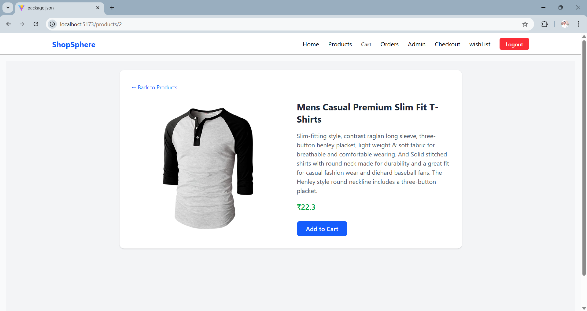
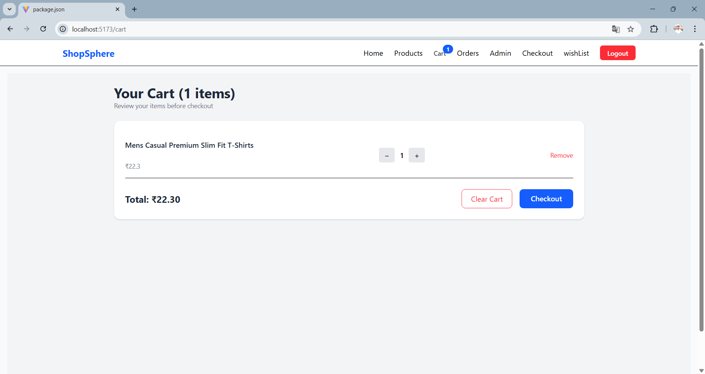
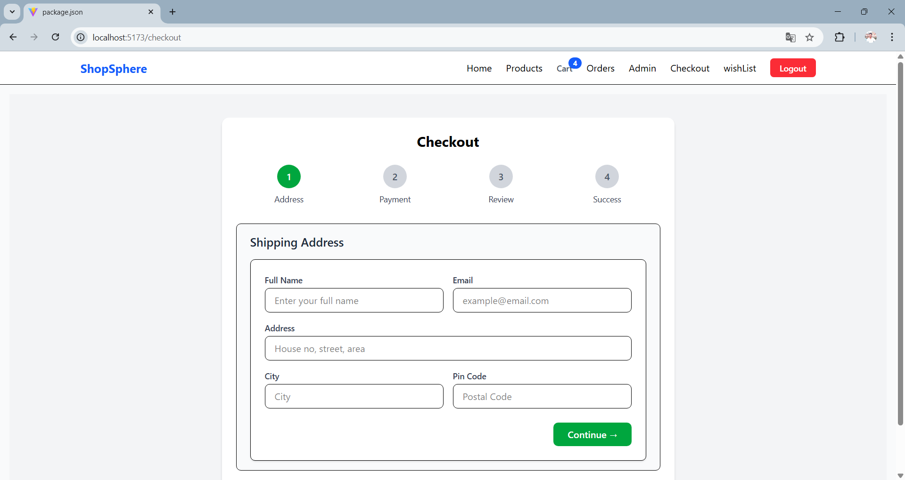
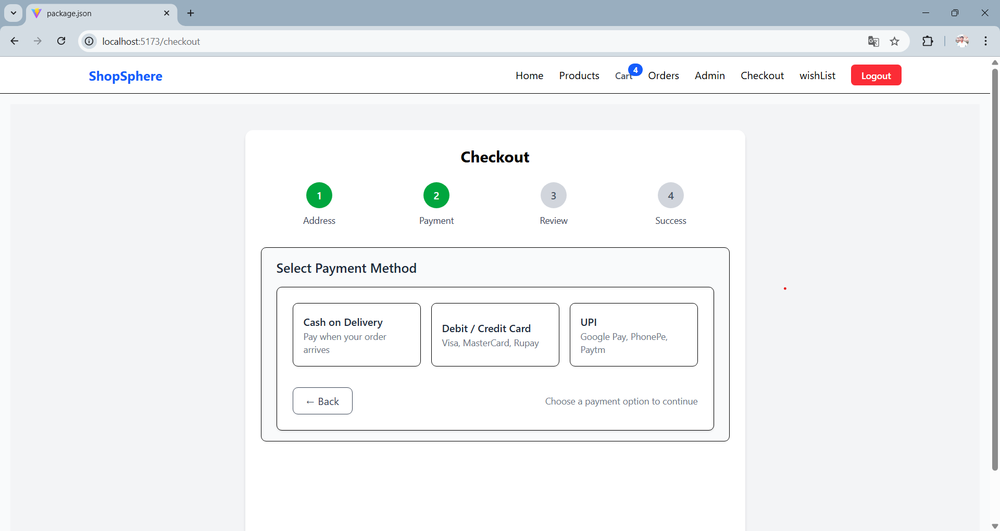
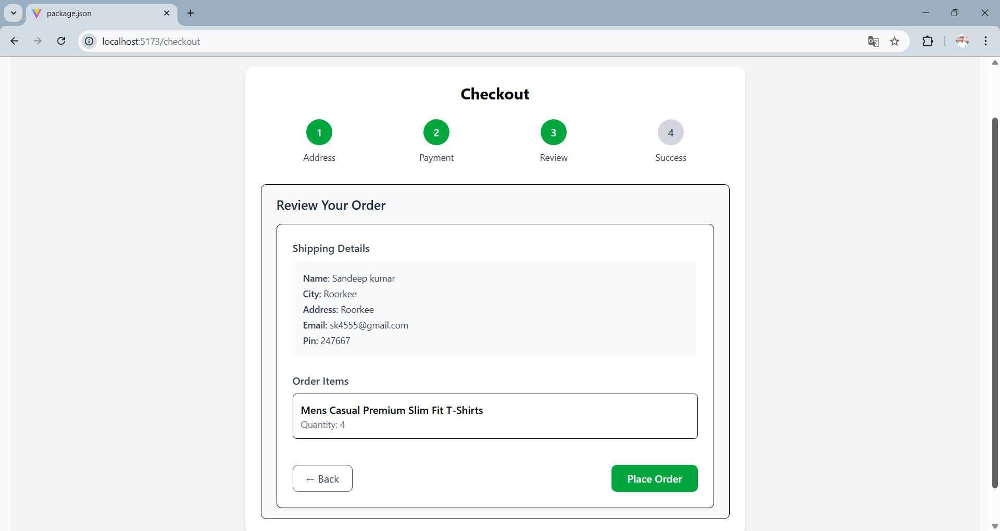
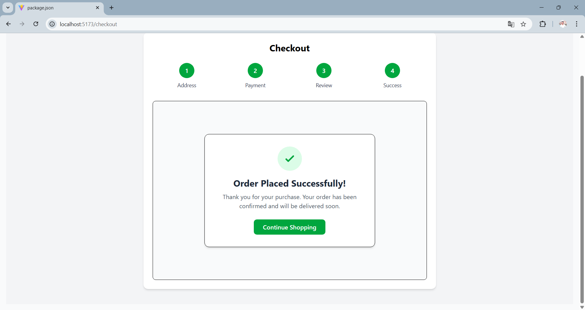
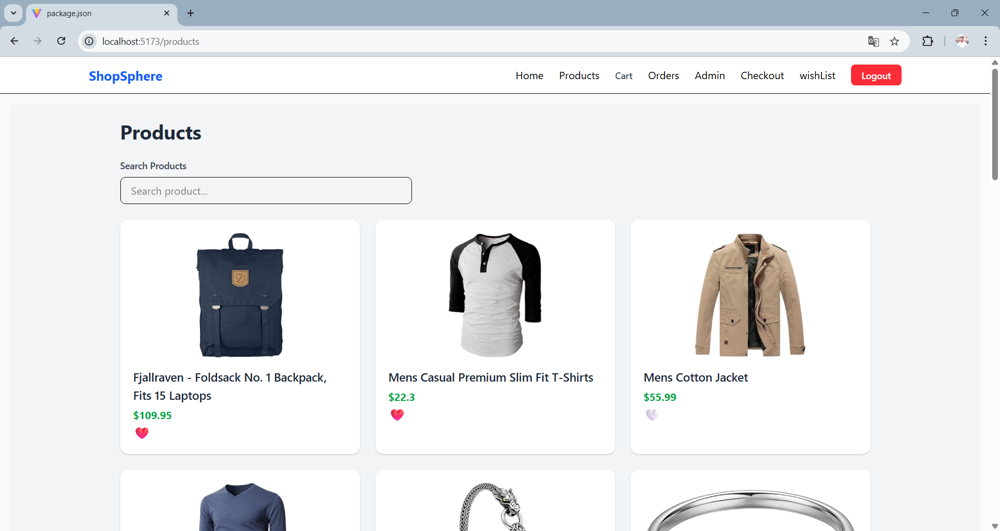

# 🛒 ShopSphere – Advanced React E-Commerce App

A modern, production-ready e-commerce application built with React, Redux Toolkit, and modern React features.
This project demonstrates advanced frontend architecture, performance optimization, and real-world patterns.


 
## ✅ Core Features

 - Product listing with API integration

 - Product details page

 - Search with deferred updates

 - Category & price filtering

 - Shopping cart with quantity control

 - Wishlist with optimistic UI

 - Multi-step checkout flow

 - Global notifications

 - Error handling & rollback

 - Protected routes

 - Clean routing with layouts

 ---


## 🧠 Advanced React Concepts Used

- ✅ React Router (`createBrowserRouter`)
- ✅ Redux Toolkit
- ✅ Async Thunks
- ✅ Optimistic UI
- ✅ Middleware
- ✅ `useDeferredValue`
- ✅ Custom Hooks
- ✅ Global Notifications
- ✅ Error Boundaries
- ✅ Controlled Forms
- ✅ Clean Architecture


  ---

## 🧩 Tech Stack
- Sandeep
- React 18	
- Redux Toolkit	
- React Router v6	Routing
- Tailwind CSS	
- Async Thunks	
- Jest + RTL	
- Vite


---


## 🗂️ Project Structure

```text
src
│   App.css
│   App.jsx
│   index.css
│   main.jsx
│
├── app
│   └── store.js
│
├── assets
│   └── react.svg
│
├── components
│   │   WishListButton.jsx
│   │
│   ├── checkout
│   │   ├── Address.jsx
│   │   ├── OrderSuccess.jsx
│   │   ├── Payment.jsx
│   │   └── Review.jsx
│   │
│   └── noticatoin
│       └── Notification.jsx
│
├── features
│   ├── auth
│   │   └── authSlice.js
│   │
│   ├── cart
│   │   ├── cartSelector.js
│   │   └── cartSlice.js
│   │
│   ├── checkout
│   │   └── checkoutSlice.js
│   │
│   ├── notification
│   │   └── notificationSlice.js
│   │
│   ├── products
│   │   ├── productAPI.js
│   │   ├── productSelector.js
│   │   └── productSlice.js
│   │
│   └── wishList
│       ├── wishListAPI.js
│       └── wishListSlice.js
│
├── hooks
├── layouts
│   └── RootLayout.jsx
│
├── middleware
│   └── notificationMiddleware.js
│
├── pages
│   ├── Admin.jsx
│   ├── Cart.jsx
│   ├── Checkout.jsx
│   ├── Home.jsx
│   ├── Login.jsx
│   ├── Orders.jsx
│   ├── ProductDetails.jsx
│   ├── Products.jsx
│   ├── WishList.jsx
│   └── Error
│       └── ErrorPage.jsx
│
├── routes
│   ├── ProtectedRoutes.jsx
│   └── router.jsx
│
└── services

```


## 🛠️ Installation & Run

```bash
git clone https://github.com/sandeep8077/EcommersShopShpere
cd shopsphere
npm install
npm run dev
```


## 🧪 Running Tests
 
  npm run dev


## 🧠 Architectural Decisions

- Feature-based folder structure

- Redux Toolkit for predictable state

- Async logic separated from UI

- Middleware for cross-cutting concerns

- Declarative routing


## 📸 Screenshots

### Login Page


### Home Page


### Product Page


### Product Details Page


### Add to Cart 
1[AddedToCart](public/screenshots/5_addCartProduct.png)

### Cart Page


### Checkout Steps








### Wishlist

 

 

 

## 👨‍💻 Author

### Sandeep kumar 

 📧 Email: sk557618269@gmail.com

 🌐 GitHub: https://github.com/sandeep8077/EcommersShopShpere


